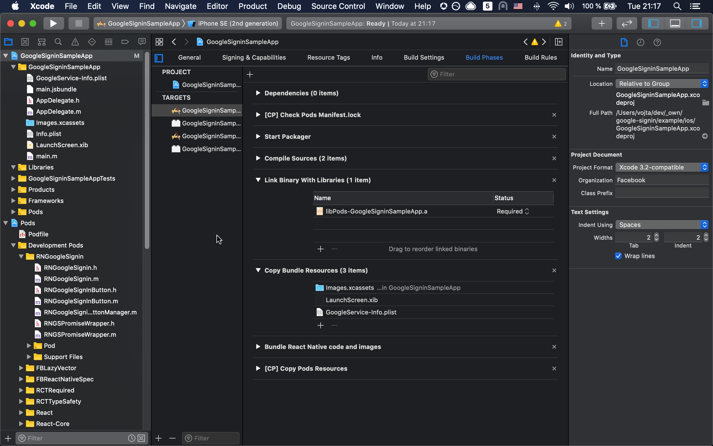
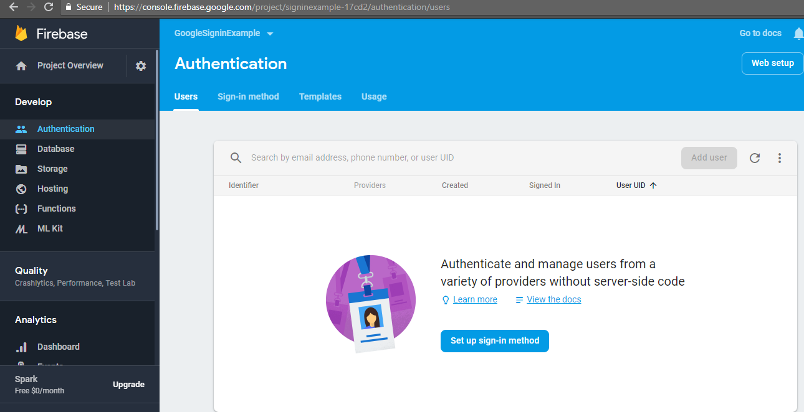
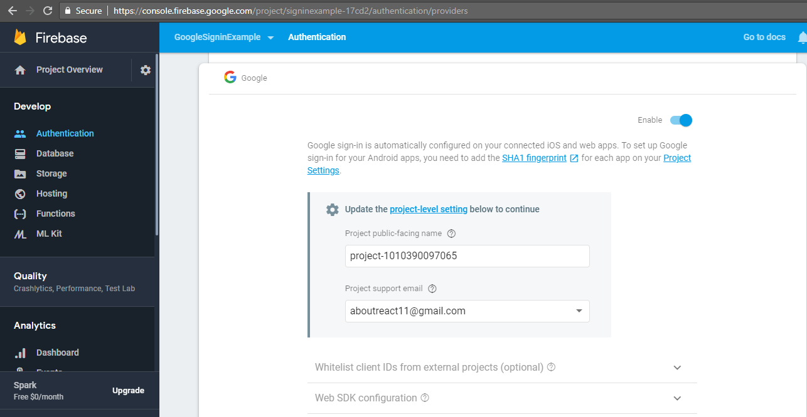
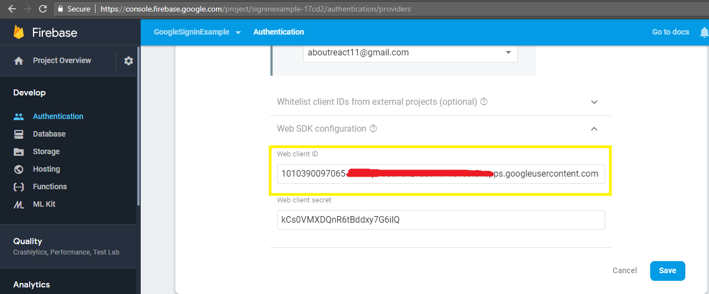

# React Native - Firebase - Google auth example

## Description
This project is example how to use Google auth with React Native. The project is based on [React Native](https://facebook.github.io/react-native/) with [Firebase](https://firebase.google.com/) is used for authentication and library [react-native-google-signin](https://github.com/react-native-google-signin/google-signin) is used.

In this README will show how to step by step setting up the project on IOS.

## Setup from scratch

1. Init Project
    - run `npx react-native init PROJECT_NAME` 
2. Install dependencies
    -  run `yarn install @react-native-google-signin/google-signin` in project root folder

3. Configure variables
    - get "GoogleService-info.plist" from [this link](https://github.com/react-native-google-signin/google-signin/blob/c9256889b58c4593ca5faf354d6d8bf58369eafa/docs/get-config-file.md)
    - save it to `/ios/PROJECT_NAME` folder
    - open `Podfile` in `/ios` folder and add the following line:
        `pod 'GoogleSignIn', '~> 6.0.2'`
    - run `pod install` in `/ios` folder
    - open Xcode and open foler `/ios/PROJECT_NAME.xcworkspace` your project should look like this:

        
    - Configure URL types in the `Info` panel (see screenshot)
      - add a URL with scheme set to your REVERSED_CLIENT_ID (found inside GoogleService-Info.plist)

        

4. Enable Authentication from Firebase Console
    - Now open your firebase project in Firebase console and click the Authentication option in the left side tab
    
    - Here click on the “Set up the sign-in method” and you will find all type of sign-in providers that firebase supports. Choose Google from the number of Sign-in providers and Enable it
    
    - Please scroll down and find web SDK configuration option, click on it and you will find web client ID, please remember you have to copy-paste this web client ID in the code below so keep it open or paste it somewhere.
    

5. Coding
    - Copy code from this [link](https://aboutreact.com/example-of-google-sign-in-in-react-native/) and paste it in `App.js` file.\
    **Please do remember to replace REPLACE_YOUR_WEB_CLIENT_ID_HERE with your Web Client Id from Authentication tab**

6. Build and Run
    - in project root folder, run `yarn start`
    - spin new terminal and run `yarn ios`

## Refs

[IOS guide configuration](https://github.com/react-native-google-signin/google-signin/blob/HEAD/docs/ios-guide.md)

[Google sign in example](https://aboutreact.com/example-of-google-sign-in-in-react-native/)